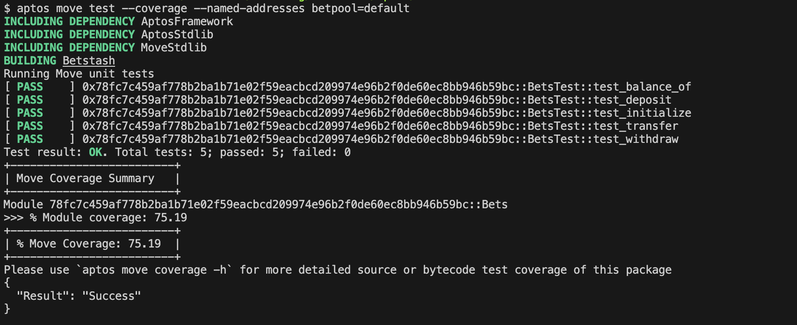

To include the image in your `README.md` file, you can use the markdown syntax for embedding images. Here's how you can update your `README.md` to include the image and the test results:

# Move Smart Contract: `Bets` Module

This repository contains a Move smart contract module named `Bets`, which allows users to initialize, deposit, withdraw, and transfer APT tokens. The module also provides a function to check the balance of an account.

## Table of Contents

1. [Overview](#overview)
2. [Getting Started](#getting-started)
   - [Prerequisites](#prerequisites)
   - [Installation](#installation)
3. [Compiling the Smart Contract](#compiling-the-smart-contract)
4. [Testing the Smart Contract](#testing-the-smart-contract)
5. [Module Functions](#module-functions)
6. [Test Cases](#test-cases)
7. [License](#license)

---

## Overview

The `Bets` module is a Move smart contract that provides the following functionality:

- **Initialize**: Initialize an account with an `AptBalance` resource.
- **Deposit**: Deposit APT tokens into an account.
- **Withdraw**: Withdraw APT tokens from an account.
- **Transfer**: Transfer APT tokens from one account to another.
- **Balance Check**: Check the balance of an account.

The module is designed to be secure and efficient, leveraging Move's resource-oriented programming model.

---

## Getting Started

### Prerequisites

Before you begin, ensure you have the following installed:

- [Move CLI](https://github.com/move-language/move): The Move command-line interface for compiling and testing Move modules.
- [Aptos CLI](https://aptos.dev/cli): Optional, if you plan to deploy the module on the Aptos blockchain.

### Installation

1. Clone this repository:

   ```bash
   https://github.com/betstash/contracts.git
   cd contracts
   ```

2. Set up the Move environment:

   ```bash
   move init
   ```

---

## Compiling the Smart Contract

To compile the `Bets` module, run the following command:

```bash
move build
```

This will compile the Move module and generate the necessary bytecode files in the `build` directory.

---

## Testing the Smart Contract

The repository includes a set of test cases to verify the functionality of the `Bets` module. To run the tests, use the following command:

```bash
move test
```

### Test Output

If all tests pass, you should see output similar to this:

```
Running Move unit tests
[ PASS ] 0x7Bfc7c459af778b2ba1b71e02759eacbcd209974e96b2f0de66ec6bb946b59bc::BetsTest::test_balance_of
[ PASS ] 0x7Bfc7c459af778b2ba1b71e02759eacbcd209974e96b2f0de66ec6bb946b59bc::BetsTest::test_deposit
[ PASS ] 0x7Bfc7c459af778b2ba1b71e02759eacbcd209974e96b2f0de66ec6bb946b59bc::BetsTest::test_initialize
[ PASS ] 0x7Bfc7c459af778b2ba1b71e02759eacbcd209974e96b2f0de66ec6bb946b59bc::BetsTest::test_transfer
[ PASS ] 0x7Bfc7c459af778b2ba1b71e02759eacbcd209974e96b2f0de66ec6bb946b59bc::BetsTest::test_withdraw
Test result: OK. Total tests: 5; passed: 5; failed: 0
```

### Test Coverage

The test coverage for the module is as follows:

### Test Results Screenshot



---

## Module Functions

### `initialize(account: &signer)`

Initializes an account with an `AptBalance` resource. The balance is set to `0`.

### `deposit(account: &signer, amount: u64)`

Deposits the specified amount of APT tokens into the account.

### `withdraw(account: &signer, amount: u64)`

Withdraws the specified amount of APT tokens from the account.

### `balance_of(account_addr: address): u64`

Returns the balance of the specified account.

### `transfer(from: &signer, to: address, amount: u64)`

Transfers the specified amount of APT tokens from one account to another.

---

## Test Cases

The following test cases are included to verify the functionality of the `Bets` module:

1. **`test_initialize`**: Verifies that the `initialize` function correctly initializes an account with a balance of `0`.
2. **`test_deposit`**: Verifies that the `deposit` function correctly increases the balance of an account.
3. **`test_withdraw`**: Verifies that the `withdraw` function correctly decreases the balance of an account.
4. **`test_balance_of`**: Verifies that the `balance_of` function returns the correct balance of an account.
5. **`test_transfer`**: Verifies that the `transfer` function correctly transfers tokens between accounts.

---

## Acknowledgments

- [Move Language Documentation](https://move-language.github.io/move/)
- [Aptos Developer Documentation](https://aptos.dev)

---

## Support

If you encounter any issues or have questions, please open an issue in this repository or reach out to the maintainers.

---

Happy coding! 🚀
```

### How to Use

1. Copy the above script into a file named `README.md`.
2. Place the `README.md` file in the root directory of your Move project.
3. Ensure the image file (`Screenshot 2025-02-20 at 12.29.04 AM.png`) is in the same directory as the `README.md` file or provide the correct relative path to the image.
4. Update the repository URL in the "Installation" section to match your actual repository URL.
5. Commit and push the `README.md` file and the image to your repository.

This `README.md` provides clear instructions for compiling, testing, and understanding the functionality of your Move smart contract. It also includes a section for acknowledgments and support.
